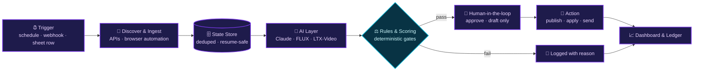
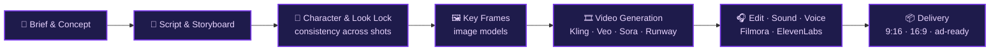

<!-- ═══════════════════════ HEADER ═══════════════════════ -->
<div align="center">


<a href="https://github.com/itzmoksh01">
  <picture>
    <source media="(prefers-color-scheme: dark)" srcset="https://readme-typing-svg.demolab.com?font=Fira+Code&size=22&duration=3200&pause=900&color=A78BFA&center=true&vCenter=true&width=780&height=48&lines=I+build+AI+systems+that+actually+ship+%F0%9F%9A%80;Prompt+Engineering+%C2%B7+AI+Agents+%C2%B7+Automation;Problem+%E2%86%92+Architecture+%E2%86%92+Automation+%E2%86%92+AI+%E2%86%92+Deploy;Gen+AI+video+%26+content+at+Moksh+AI+Studio+%F0%9F%8E%AC"/>
    <source media="(prefers-color-scheme: light)" srcset="https://readme-typing-svg.demolab.com?font=Fira+Code&size=22&duration=3200&pause=900&color=6D28D9&center=true&vCenter=true&width=780&height=48&lines=I+build+AI+systems+that+actually+ship+%F0%9F%9A%80;Prompt+Engineering+%C2%B7+AI+Agents+%C2%B7+Automation;Problem+%E2%86%92+Architecture+%E2%86%92+Automation+%E2%86%92+AI+%E2%86%92+Deploy;Gen+AI+video+%26+content+at+Moksh+AI+Studio+%F0%9F%8E%AC"/>
    
  </picture>
</a>

<br/><br/>

<a href="https://www.linkedin.com/in/itzabhishek"></a>
<a href="mailto:itzmoksh01@gmail.com"></a>
<a href="https://instagram.com/moksh.ai.studio"></a>


<br/><br/>

<a href="#-about-me"></a>
<a href="#-my-automation-blueprint"></a>
<a href="#-featured-projects"></a>
<a href="#-tech-arsenal"></a>
<a href="#-moksh-ai-studio"></a>
<a href="#-work-with-me"></a>

</div>

<br/>

```ts
const abhishek = {
  role: "Generative AI Specialist · AI Automation Engineer · AI Agent Builder",
  studio: "Moksh AI Studio",
  builds: ["AI automation systems", "AI agents", "Gen AI video & content", "production web apps"],
  principles: ["idempotent", "resume-safe", "human-in-the-loop", "dry-run before live"],
  stack: ["TypeScript", "Python", "Claude API", "n8n", "Playwright", "React"],
  currentlyBuilding: "AI sales lead-gen & outreach engine",
  openTo: ["AI Automation roles", "AI Agent roles", "Generative AI roles", "freelance projects"],
  from: "India 🇮🇳",
};
```

<div align="center">


</div>


## 👋 About Me

I work at the intersection of **Generative AI, Prompt Engineering, AI Automation, AI Agents and Product Engineering**. I started with Gen AI video & content (freelance, since mid-2024), and today I also build automation, agents and full-stack AI systems.

My focus is not just generating AI output. I build **systems that keep running without babysitting**, and that can:

<table>
<tr>
<td>🔎 <b>Discover</b> & process real-world data</td>
<td>🔌 <b>Connect</b> multiple APIs & services</td>
<td>✨ <b>Generate</b> AI-powered content</td>
</tr>
<tr>
<td>⚖️ <b>Decide</b> with rule-based logic</td>
<td>💾 <b>Persist</b> state across runs</td>
<td>♻️ <b>Recover</b> from failures</td>
</tr>
<tr>
<td>🚫 <b>Avoid</b> duplicate actions</td>
<td>📊 <b>Expose</b> dashboards & controls</td>
<td>👤 <b>Keep humans</b> in the loop</td>
</tr>
</table>


## 🧬 My Automation Blueprint

Every system I build follows the same reliability-first pattern:




## 📈 Verified Results

*Pulled straight from my own repos, no inflated numbers.*

<table>
<tr>
<td width="33%" align="center" valign="top">
<h3>60 → 58</h3>
<b>🧲 Lead Engine</b><br/>
places discovered → qualified leads on a live <code>"cafes in Delhi"</code> run, with 15 emails enriched
</td>
<td width="33%" align="center" valign="top">
<h3>3 × ~8s → 1080×1920</h3>
<b>🎬 Content Pipeline</b><br/>
one spreadsheet row → AI scenes → upscaled vertical video → human approval → Reels · Facebook · Shorts
</td>
<td width="33%" align="center" valign="top">
<h3>0–100 · ≥ 70</h3>
<b>🤖 Job Engine</b><br/>
deterministic fit score, applies only above the threshold, 5 truthful resume variants, Gmail radar that only <i>drafts</i>
</td>
</tr>
</table>


## 🚀 Featured Projects

<table>
<tr>
<td width="50%" valign="top">

**🧲 [AI Leads & Sales Automation](https://github.com/itzmoksh01/AI-Leads-And-Sales-Automation)**

*One search in → qualified leads + personalized outreach out.*

Discovers businesses via **Google Places**, enriches contacts, logs leads to **Google Sheets**, writes a **personalized pitch per lead with Claude**, and prepares **WhatsApp + Email** outreach. Rate-limited, idempotent, resume-safe, **dry-run by default**. Phases 1–5 verified; inbound reply listener and 24/7 scheduler are next.


</td>
<td width="50%" valign="top">

**🎬 [AI Social Media Content Automation](https://github.com/itzmoksh01/AI-Social-Media-Content-Automation)**

*A spreadsheet row in → an approved, published short-form video out.*

Script → scene prompts → reference image → animated scenes → upscale → music mix → **human approval gate** → auto-publish to **Reels, Facebook & YouTube Shorts**. Default engine runs on free-tier Hugging Face models (**FLUX.1-schnell + LTX-Video**), locally or unattended via GitHub Actions.


</td>
</tr>
<tr>
<td width="50%" valign="top">

**🤖 [AI Job Application Automation](https://github.com/itzmoksh01/AI-Job-Application-Automation)**

*Finds the right jobs, scores them, and applies while you sleep.*

Scans Naukri hourly, scores every fresh listing against a profile, applies with the **best-fit tailored resume**, and watches Gmail for interview invites with **draft replies for approval**. Includes a live Streamlit dashboard. Built to be truthful: it would rather skip a question than invent an answer.


</td>
<td width="50%" valign="top">

**📊 [MS2 Project Tracker](https://github.com/itzmoksh01/Ms2-Project-Tracker)**

*A production-tracking dashboard for media teams.*

Responsive dashboard where **admins assign projects** and **employees log daily progress**, built for MS2 Entertainment's production workflow.


</td>
</tr>
<tr>
<td width="50%" valign="top">

**🌐 [MS2 Full Website Build](https://github.com/itzmoksh01/MS2-Full-Website-Build)**

*A full-stack production website for an entertainment brand.*

Complete **client · server · shared** architecture with database migrations, Cloudflare Functions and a deployment guide.


</td>
<td width="50%" valign="top">

**🚘 [MAXOTO Booking Page Build](https://github.com/itzmoksh01/Maxoto-Booking-Page-Build)**

*A booking page built for MAXOTO, an automotive performance brand.*

Client work delivered in TypeScript.


</td>
</tr>
</table>


## 🧰 Tech Arsenal

<table>
<tr>
<td width="50%" valign="top">

**💻 Languages & Runtime**<br/>


</td>
<td width="50%" valign="top">

**🧠 AI, LLMs & Agents**<br/>


</td>
</tr>
<tr>
<td width="50%" valign="top">

**⚙️ Automation & Integrations**<br/>


</td>
<td width="50%" valign="top">

**🌐 Web & Product**<br/>


</td>
</tr>
<tr>
<td colspan="2" valign="top">

**🎬 Generative Media Stack**<br/>


</td>
</tr>
</table>


## 🧱 How I Build

<table>
<tr>
<td width="50%" valign="top">

**♻️ Idempotent & resume-safe**<br/>
Crash at 3 AM? It restarts clean. No duplicate sends, no lost leads.

</td>
<td width="50%" valign="top">

**🧪 Dry-run before live**<br/>
Outreach is logged, never sent, until I explicitly go live.

</td>
</tr>
<tr>
<td width="50%" valign="top">

**👤 Human approval gates**<br/>
AI drafts, humans decide. Nothing publishes or sends unchecked.

</td>
<td width="50%" valign="top">

**✅ Verified phase by phase**<br/>
Every build phase ships with a runnable check and a written result.

</td>
</tr>
<tr>
<td width="50%" valign="top">

**🤝 Truthful automation**<br/>
Unknown answer? It stays blank and gets logged. It never invents.

</td>
<td width="50%" valign="top">

**🔐 Secrets stay out of the repo**<br/>
Env templates only. Credentials never touch version control.

</td>
</tr>
</table>


## 🎬 Moksh AI Studio

I run **Moksh AI Studio**, a Generative AI video and content agency. I deliver AI-powered brand films, ad creatives and content systems for clients across **automotive, FMCG, entertainment and hospitality**.



<!-- 🎥 Add a 10-15s showreel GIF here when ready (upload it to this repo):
<p align="center"></p>
-->

<div align="center">

<a href="https://instagram.com/moksh.ai.studio"></a>

</div>


## 🤝 Work With Me

<table>
<tr>
<td width="50%" valign="top">

**⚙️ AI Automation Systems**<br/>
Lead-gen, outreach, content and business-process automation that runs reliably on its own.

</td>
<td width="50%" valign="top">

**🤖 AI Agents & Agentic Workflows**<br/>
Agents with guardrails, state, approval gates and clear dashboards.

</td>
</tr>
<tr>
<td width="50%" valign="top">

**🎬 Gen AI Video & Content**<br/>
Ad films, brand stories and short-form content through Moksh AI Studio.

</td>
<td width="50%" valign="top">

**🌐 Web Apps & Dashboards**<br/>
Responsive React / TypeScript products, from booking flows to internal trackers.

</td>
</tr>
</table>

<div align="center">

**Got a workflow that eats your team's time, or an AI video idea? Let's automate it.**

<br/>

<a href="https://www.linkedin.com/in/itzabhishek"></a>
<a href="mailto:itzmoksh01@gmail.com"></a>
<a href="https://instagram.com/moksh.ai.studio"></a>

</div>

<!--
  OPTIONAL, uncomment later:

  1) Contribution snake. Uncomment only AFTER the "Generate Snake" workflow has run once:
  <div align="center">
    <picture>
      <source media="(prefers-color-scheme: dark)" srcset="https://raw.githubusercontent.com/itzmoksh01/itzmoksh01/output/github-snake-dark.svg"/>
      <source media="(prefers-color-scheme: light)" srcset="https://raw.githubusercontent.com/itzmoksh01/itzmoksh01/output/github-snake.svg"/>
      
    </picture>
  </div>

  2) Stats cards. Better once you have more commits and stars:
  <div align="center">
    
  </div>
-->

<br/>

<div align="center">

*⭐ If something here helped you, a star on the repo means a lot.*


</div>
