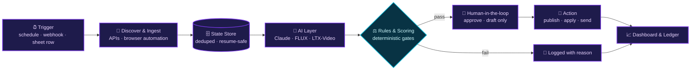

<!-- ═══════════════════════ HEADER ═══════════════════════ -->
<div align="center">


<a href="https://github.com/itzmoksh01">
  
</a>

<br/><br/>

<a href="https://www.linkedin.com/in/itzabhishek"></a>
<a href="mailto:itzmoksh01@gmail.com"></a>
<a href="https://instagram.com/moksh.ai.studio"></a>


<br/><br/>

> ### *"I turn repetitive workflows into reliable, production-oriented AI automation."*

</div>

<br/>

<!-- ═══════════════════════ AT A GLANCE ═══════════════════════ -->
<div align="center">

| 🎯 **Focus** | 🧠 **Specialties** | 🎬 **Studio** | 🎓 **Certified** | 🌍 **Based in** |
|:---:|:---:|:---:|:---:|:---:|
| AI Automation & Agents | Gen AI · Prompt Engineering · Product Engineering | Founder, Moksh AI Studio | IBM Generative AI Engineering (Professional Certificate) | India 🇮🇳 |

</div>

---

## ⚡ About Me

I work at the intersection of **Generative AI, Prompt Engineering, AI Automation, AI Agents and Product Engineering**.

My focus is not just generating AI output. I build **systems that keep running without babysitting**, and that can:

<table>
<tr>
<td>🔎 <b>Discover</b> & process real-world data</td>
<td>🔌 <b>Connect</b> multiple APIs & services</td>
<td>✨ <b>Generate</b> AI-powered content</td>
</tr>
<tr>
<td>⚖️ <b>Decide</b> with rule-based logic</td>
<td>💾 <b>Persist</b> state across runs</td>
<td>♻️ <b>Recover</b> from failures</td>
</tr>
<tr>
<td>🚫 <b>Avoid</b> duplicate actions</td>
<td>📊 <b>Expose</b> dashboards & controls</td>
<td>👤 <b>Keep humans</b> in the loop</td>
</tr>
</table>

```text
Problem  →  Architecture  →  Automation  →  AI Layer  →  Verification  →  Deployment
```

---

## 🧬 My Automation Blueprint

Every system I build follows the same reliability-first pattern:



---

## 📈 Verified Results *(straight from my repos)*

<table>
<tr>
<td width="33%" valign="top">

**🧲 Lead Engine**<br/>
Live run on `"cafes in Delhi"`:<br/>
**60** places discovered → **58** qualified leads → **15** emails enriched

</td>
<td width="33%" valign="top">

**🎬 Content Pipeline**<br/>
1 spreadsheet row → **3 AI scenes** → upscaled to **1080×1920** → human approval → **Instagram · Facebook · YouTube**

</td>
<td width="33%" valign="top">

**🤖 Job Engine**<br/>
**0–100** deterministic fit score → applies at **≥ 70** → **5** truthful resume variants → Gmail radar *drafts, never sends*

</td>
</tr>
</table>

---

## 🚀 Featured Projects

<table>
<tr>
<td width="50%" valign="top">

### 🧲 [AI Leads & Sales Automation](https://github.com/itzmoksh01/AI-Leads-And-Sales-Automation)
*One search in → qualified leads + personalized outreach out.*

Type a query, and the pipeline discovers businesses via **Google Places**, enriches contacts, logs leads to **Google Sheets**, writes a **personalized pitch per lead with Claude**, and prepares **WhatsApp + Email** outreach. Rate-limited, idempotent, resume-safe, and **dry-run by default**.


</td>
<td width="50%" valign="top">

### 🎬 [AI Social Media Content Automation](https://github.com/itzmoksh01/AI-Social-Media-Content-Automation)
*A spreadsheet row in → a finished, approved, published short-form video out.*

Script → scene prompts → reference image → animated scenes → upscale → music mix → **human approval gate** → auto-publish to **Reels, Facebook & YouTube Shorts**. Runs **100% free** on Hugging Face models, locally or unattended via GitHub Actions.


</td>
</tr>
<tr>
<td width="50%" valign="top">

### 🤖 [AI Job Application Automation](https://github.com/itzmoksh01/AI-Job-Application-Automation)
*Finds the right jobs, scores them, and applies while you sleep.*

Scans Naukri hourly, scores every fresh listing against a profile, applies with the **best-fit tailored resume**, and watches Gmail for interview invites with **draft replies for approval**. Built to be truthful: it would rather skip a question than invent an answer.


</td>
<td width="50%" valign="top">

### 📊 [MS2 Project Tracker](https://github.com/itzmoksh01/Ms2-Project-Tracker)
*A production-tracking dashboard for media teams.*

Responsive dashboard where **admins assign projects** and **employees log daily progress**, built for a real animation/media production workflow.


</td>
</tr>
<tr>
<td width="50%" valign="top">

### 🌐 [MS2 Full Website Build](https://github.com/itzmoksh01/MS2-Full-Website-Build)
*A full-stack production website for an entertainment brand.*

Complete client / server / shared architecture with database migrations and edge functions, deployment guide included.


</td>
<td width="50%" valign="top">

### 🏍️ [MAXOTO Booking Page Build](https://github.com/itzmoksh01/Maxoto-Booking-Page-Build)
*A conversion-focused booking experience for an automotive performance brand.*

Built as part of my client work with MAXOTO, from booking UI to the flow that connects customers with the team.


</td>
</tr>
</table>

---

## 🛠️ Tech Arsenal

**💻 Languages & Runtime**<br/>


**🧠 AI, LLMs & Agents**<br/>


**⚙️ Automation & Integrations**<br/>


**🌐 Web & Product**<br/>


**🎬 Generative Media Stack**<br/>


---

## 🛡️ How I Build

<table>
<tr>
<td width="33%" valign="top">

**♻️ Idempotent & resume-safe**<br/>
Crash at 3 AM? It restarts clean. No duplicate sends, no lost leads.

</td>
<td width="33%" valign="top">

**🧪 Dry-run before live**<br/>
Outreach is logged, never sent, until I explicitly go live.

</td>
<td width="33%" valign="top">

**👤 Human approval gates**<br/>
AI drafts, humans decide. Nothing publishes or sends unchecked.

</td>
</tr>
<tr>
<td width="33%" valign="top">

**✅ Verified phase by phase**<br/>
Every build phase ships with a runnable verification and a written result.

</td>
<td width="33%" valign="top">

**🤝 Truthful automation**<br/>
Unknown answer? It stays blank and gets logged. It never invents.

</td>
<td width="33%" valign="top">

**🔐 Secrets never in the repo**<br/>
Env templates only. Credentials stay out of version control.

</td>
</tr>
</table>

---

## 🎬 Moksh AI Studio

<table>
<tr>
<td valign="top">

I run **Moksh AI Studio**, a Generative AI video and content agency. I deliver AI-powered brand films, ad creatives and content systems for clients across **automotive, FMCG, entertainment and hospitality**.

**🎯 What I deliver:** AI video ads & brand films · character-consistent storytelling · prompt systems & pipelines · automation for content and sales

<a href="https://instagram.com/moksh.ai.studio"></a>

</td>
</tr>
</table>

---

## 📊 GitHub Analytics

<div align="center">


</div>

<!--
  Uncomment once your activity grows (more commits and stars make these look great):

<div align="center">
  
  
</div>
-->

---

## 🔭 Right Now

- 🧲 **Building:** AI sales lead-gen & outreach engine (inbound reply listener, 24/7 scheduler + dashboard, and go-live are next)
- 🎬 **Shipping:** AI video & content work through Moksh AI Studio
- 💬 **Ask me about:** prompt engineering · n8n & AI automation · AI agents · Gen AI video workflows
- 🤝 **Open to:** AI Automation, AI Agent and Generative AI roles, plus freelance & studio projects

---

## 🤝 Let's Build Something

<div align="center">

**Got a workflow that eats your team's time? An AI video idea? Let's automate it.**

<br/>

<a href="https://www.linkedin.com/in/itzabhishek"></a>
<a href="mailto:itzmoksh01@gmail.com"></a>
<a href="https://instagram.com/moksh.ai.studio"></a>

<br/><br/>

*⭐ If something here helped you, a star on the repo means a lot.*


</div>
